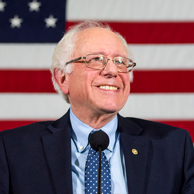

# Campaign Speech Analysis using NLP

## Project Overview

Using Natural Language Processing, I analyzed presidential campaign speeches, going back to the 1996 campaign, to see if the language used can predict if a candidate will win the nomination. 

Natural Language Processing, usually shortened as NLP, is a branch of artificial intelligence that deals with the interaction between computers and humans using the natural language. The ultimate objective of NLP is to read, decipher, understand, and make sense of the human languages in a manner that is valuable.

A link to my presentation- http://35.231.242.143:3000/

## Data Gathering

For this project I used data from a total of 1691 speeches that were webscraped from https://www.presidency.ucsb.edu

## Data Cleaning 

To clean, tokenize and parse the speeches, I used the spaCy library. spaCy is a library for advanced Natural Language Processing in Python. It's built on the very latest research, comes with pre-trained statistical models and word vectors, and currently supports tokenization for over 49 languages. It features state-of-the-art speed, convolutional neural network models for tagging, parsing and named entity recognition and easy deep learning integration.

## Candidate EDA

I created a function that generates visualizations for the **"most common phrases"**, **"top NOUNs use"** and **"top entities mentioned"**.

Below are a few examples: 

**Barack Obama**

**Mitt Romney**

**Hillary Clinton**

**Bernie Sanders**

## Baseline Binary Model

First I created a baseline model (using **logistic regression**) through a pipeline.

### Accuracy and Confusion Matrix for Baseline Model

The baseline model has a good accuracy score for predicting "nominated" candidate speeches, but is unnable to detect any speeches that did **not** lead to nomination. This is probably because of a class imbalance that skews towards "nominated" candidate speeches.

## Final Model- Linear SVC

**LinearSVC** is one of the classifiers which performs quite well on a range of NLP based text classification tasks. The objective of a Linear SVC (Support Vector Classifier) is to fit to the data you provide, returning a **"best fit" hyperplane** that divides, or categorizes, your data.

The model used the **spaCy** library to clean the text, **CountVectorizer** and **TfidfTransformer** (which transforms a count matrix to a normalized tf or tf-idf representation) to **vectorize the text**.

I trained the model on the speeches of both Democrat and Republican candidates. 

### Accuracy and Confusion Matrix for Final Model

The final model has an **accuracy of about 90%**; a rate of 86% for predicting non-nominated candidate speeches and a rate of 93% to predict nominated candidate speeches. 

The confusion matrix shows a pretty decent **minimization of Type I and Type II Errors**. 

### Predictions

I webscraped the official campaign speeches of the current top 5 2020 Democrat Presidential Candidates, and used my predictive model to predict the probablity of them winning the nomination based on their speech.

Examples:

**Joe Biden** 

**Speech Text:**

"Philadelphia, thank you, thank you, thank you. Thank you, thank you. Thank you, thank you, thank you. Thank you. Folks, thank you, Jill. I'm Joe Biden, and I'm Jill's husband. You all think I'm kidding. That's how I'm identified. Everyone knows Jill is a Philadelphia girl. She loves this city. I do, too. But to paraphrase the poet, James Joyce, I have to say this, folks, because I'm near my state, when I die, 'Delaware ' will be written on my heart. But I love Philly. Look, I'm mildly prejudice, but I think she made a great, great second lady, and she's going to make one heck of a first lady. Folks, in the past few weeks, I've been all across America -- Pittsburgh, Iowa, South Carolina, Nevada, California, New Hampshire, and today, Philadelphia. This campaign is just getting started. And I promise you this, no one, no one is going to work longer, no one is going to campaign harder to win your hearts, your trust, and your support than the son of Catherine Eugenia Finnegan from Scranton, Pennsylvania, and Joseph R. Biden from Delaware....."

**79% chance of winning the nomination!**

**Bernie Sanders**

**Speech Text:**

"Thanks you all for coming out today. Let me thank the weatherman for giving us Vermont weather. Thank you. And thank you all for being part of a political revolution which is going to transform America. (people chanting: Bernie, Bernie, Bernie, Bernie, Bernie … Bernie: No, no, no, it is not Bernie, is you. It’s us together.) I want to thank all of you for being part of a campaign which is not only going to win the Democratic nomination, which is not only going to defeat Donald Trump, who is the most dangerous president in modern American history, but with your help we are going to transform this country and, finally, create an economy and a government which works for all of us, and not just the one percent. Today, at our very first rally, I want to welcome you to a campaign which says, loudly and clearly, that the underlying principles of our government will not be greed, hatred and lies. It will not be racism, sexism, xenophobia, homophobia and religious bigotry....."

**31% chance of winning the nomination!**

## Speech Generator Using Textgenrnn

**textgenrnn** is a Python 3 module on top of Keras/TensorFlow for creating RNNs (recurrent neural network).

### Model Architecture

For my model, textgenrnn takes in an input of up to 40 characters, and implements **multi-layer Recurrent Neural Network (RNN, LSTM)** for training on my data and sampling from pretrained character-level language models. In other words the model takes the speeches as input and trains a Recurrent Neural Network that learns to predict the next character in a sequence. The RNN can then be used to **generate text character by character** that will look like the original training data.

The model used speeches from the Democrat candidates who won the nomination, **over 600 speeches**. I trained the character sequences on a **Google Cloud GPU**, so the model can try and have an understanding of the language used. It starts off by learning the most common words used, then the most common phrases and mixing them all together to **create new generated sequences**.

### Generating The Text

**Epoch 5**

“hello , iowa ! thank you ! thank you . thank you so much , everybody . thank you . thank you so much . thank you . thank you so much . thank you so much . thank you so much . thank you so much . thank you . thank you so much . thank you . thank you so much . thank you . thank you so much . thank you very much , everybody . thank you . thank you so much . thank you . thank you so much . thank you . thank you so much . thank you so much . wow ! thank you so much , everybody . thank you . thank you so much . thank you . thank you so much . thank you so much , everybody . thank you . thank you so much , everybody . thank you . thank you so much , everybody . thank you . thank you so much . wow ! thank you so much . thank you . thank you so much . thank you so much . thank you very much , everybody . thank you . thank you so much . wow ! thank you so much . wow ! thank you so much . thank you so much , everybody . thank you .”

**Epoch 10**

“to do so that we can ' t make this century another american century . and i ' m going to need your help . i ' m not going to let that happen . and i ' m going to need your help . and i ' m not going to let that happen . and we ' ll remind the world why the united states of america . the president . hello , iowa ! thank you ! thank you . thank you so much , everybody . thank you . thank you so much . thank you . thank you so much . thank you so much . thank you so much . thank you so much . thank you . thank you so much . thank you . thank you so much . thank you . thank you so much . thank you very much , everybody . thank you . thank you so much . thank you . thank you so much . thank you . thank you so much . thank you so much . wow ! thank you so much , everybody . thank you . thank you so much . thank you . thank you so much . thank you so much , everybody . thank you . thank you so much , everybody . thank you . thank you so much , everybody . thank you . thank you so much . wow ! thank you so much . thank you . thank you so much . thank you so much . thank you very much , everybody . thank you . thank you so much . wow ! thank you so much . wow ! thank you so much . thank you so much , everybody . thank you .”

**Epoch 15**

“and i ' m not going to let that happen . and i ' ll tell you what i ' m going to need your help . and i ' m not going to let that happen . and i ' m going to need your help . and i ' m not going to let you know , i ' m not going to let that happen . and i ' ll tell you what i ' m going to need your help . i ' m not going to let them tell you what i thought , i ' d always tell you where i stood , and i ' d like to do is go back to the same rates we had when bill clinton was president . and he ' s been in washington . and i ' ll tell you what i ' m going to need your help . i ' m not going to let that happen . and i ' m not going to let you go back to the clinton rates . and that ' s why i ' m running for president . i ' m not going to let that happen . and i ' ll tell you what i ' m going to need your help . and i ' m not going to let that happen . and i ' ll tell you what i ' m going to need your help . i ' m not going to let you go back to the clinton rates . and i ' ll tell you what i ' m going to need your help . and i ' m not going to be easy . and i ' m not going to let them tell you what i”
Epoch 20
“going to have to be able to get the same kind of health care that members of congress get themselves . we ' re not going to make sure that we ' re investing in clean energy , and we ' re going to make sure that we ' re investing in science and technology , making sure that we ' re investing in science and technology and innovation and technology , and we ' re going to make sure that we ' re investing in science , and we ' ve got to make sure that they ' re going to have to work for it . we ' re not going to let that happen . and if you ' re willing to work hard , you can do it right now . i ' ve got a lot of work to do . we ' ve got to make sure that we ' re investing in science and innovation , in the technology we can build together . together , we touched our own lives . and if you ' re willing to work hard , you can get ahead . and i ' ll tell you , i ' m not going to be a sure . it ' s not going to be easy . it ' s a question that i ' m going to need your help . i ' m not going to let that happen . and i ' ve got to tell you , you know what ? i think it is the right thing to do . i ' m not going to sacrifice . and as long as i ' m commander in chief , the energy policy of our history .”

**Epoch 25**

“we ' re going to make sure that we ' re investing in science and research , and we ' re going to have to make sure that they ' re going to make sure that we have a president who shared the beliefs , instead of the time i met in pennsylvania . the american people have the right to give them the chance to do even more to help themselves . that ' s what i ' m fighting for . that ' s why i ' m running for president . i want to make sure that those who are being forced to go to war . we can ' t just have to work with me . and i ' ll tell you what , i ' m not going to sacrifice for the next generation . we ' ll invest in preventative care , making sure that young people can stay on their parent ' s plan . and that ' s why i ' m running for a second term as president of the united states . good morning , i want to make sure that our schools are the best we can do . we ' ve got to make sure that we ' re investing in things that have been left in our way . and i ' m going to need your help . and i ' m going to need your help . we need a president who will fight for our common common - sense regulations to prevent a crisis like this from ever happening again . so i ' m not going to let them say you ' re going to have to be a leader who opposed this war .”

**Epoch 30**

“well , i think that it was important to be a mistake . i think that we can do . this is a time for america . and it ' s time to turn the page on 47 million americans . it ' s time to turn the page on the failed policies of the past . and it ' s time to turn the page on a failed politics of the american dream . it is a moral obligation to turn the page . it ' s time to turn the page on the failed policies of the american dream . that is why i ' d be running for president . i ' m tired of talking to conform to the american people . and i ' m not just going to be going to be a situation in iraq . it ' s a plan that ' s been hard to be about the next president . i think , i want to be a mistake . i think it ' s a choice between washington too . and it ' s time to turn the page on the failed policies of the bush policies . that ' s why i ' m running”

**Epoch 35**

“we ' re not going to be able to retire with dignity and respect . and that ' s why i ' m running for president of the united states . audience members . boo ! the president . now , i ' ve got to admit that i ' m going to take a few more years to solve all our problems . and i ' m going to go to the white house , and i ' m not going to be a perfect president . but i ' m not going to stand here . and we ' re going to make sure that we ' re rebuilding our alliances , but also the other side has been willing to spend and that ' s what i ' ll do as president . i ' m not going to turn medicare into a voucher just to pay for another millionaire ' s tax cut . that ' s the future we can ' t afford to see a doctor , or send their child to college , or pay more for college or eliminating groceries , or not to powerful the military , and it ' s obama ' s fault . i ' ll be a president who stands for work and faced for a simple belief that our country is stronger when we can count on affordable health care , and that ' s what i ' ll do as president . but i promised that we would cut taxes for the middle class , but not just a few , but i don ' t think that ' s the wrong direction for america . we will do this . we can do this . we can do this . americans have done this”

